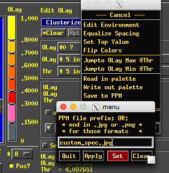
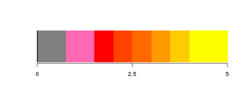

# LNCDR
Convenience functions for the LNCD

## Install
```R
# install devtools if needed
if (!'devtools' %in% installed.packages()) install.packages('devtools')
# install with devtools
devtools::install_github('LabNeuroCogDevel/LNCDR')
# if reinstalling, also run
detach("package:LNCDR", unload=TRUE)
```
## Help
For help on all functions, in an R console, see `?LNCDR::`<kbd>tab</kbd>

## Functions

### Data Wrangling

#### `save1D`
Dataframe to 1D file:

Given a data frame with a `block` column and a specified onset column, generate a 1D file for use in afni's `3dDeconvolve`.

#### `date_match`
Match behavioral visit to scan visit.

Given two dataframes, both with a column of near matching dates, find the best match between the two.

#### `col_ungroup`
extract variable grouped columns into rows
```
a.mean b.mean c.mean a.std b.std c.std
     1      2      3    .6    .5   .4

TO

grp  mean  std
a    1     .6
b    2     .5
c    3     .4

```

#### `db_query`
use `.pg_pass` to make quick queries to central database.

#### `interactive_label_match`
match labels from one string vector with another

#### `uppsp_scoring`
scores uppsp 59-item 

### Stats

#### `gam_growthrate`


```R
 m <- gam(f1score ~ s(Ageatvisit) + s(visit) + s(id, bs="re"), data=d)
 ci <- gam_growthrate(m, 'Ageatvisit')
 gam_growthrate_plot(d, m, ci, 'Ageatvisit','f1score','id')
```

#### `zscore` `zscorecols` `zscorewithinfactor`
zscore dataframes

#### `lmer_extract`
get values (t, chisq, p) from a single variable in a model

### Misc

#### `waterfall_plot`

Plot age at each visit for each participant.

#### `pubmed_search`
For meta analysis, get a dataframe of pubmed search results (doi, title, authors, journal, year, abstract)
```R
  btc_papers <- pubmed_search("Tervo-Clemmens[Author]", "tmp_xml/authsearch")

  #  journal  title   year  abstract                                doi   authors
  #  Biologi… Early … 2018  Retrospective neuroimaging studies hav… 10.1… Tervo-C…
  #  NeuroIm… Adoles… 2018  Given prior reports of adverse effects… 10.1… Tervo-C…
  #  Frontie… Neural… 2017  Risk for substance use disorder (SUD) … 10.3… Tervo-C…
  #  Annual … An int… 2015  "Brains systems undergo unique and spe… 10.1… Luna, B…
  #  Journal… Explor… 2013  Comorbid depression and anxiety disord… 10.4… Boyd, R…
```

#### `lunaize`
A better alternative is probably [`cowplot::theme_cowplot()`](https://github.com/wilkelab/cowplot).

Apply Dr. Luna's style to a ggplot. See `?lunaize` for usage.


### Imaging

#### `to_nii`
write a nifti file from a voxelwise dataframe

#### `vox_cor`
Given a seed region (mask) and target region (mask), return voxelwise correlations from a 4d nifti.

```R
seed <- read_mask("striatum_mask.nii.gz")
target <- read_mask("gm_mask.nii.gz")
target <- target & ! seed
allcors <- vox_cor("subj_ts.nii.gz",seed,target)
```


#### ijk functions
Convert ijk indexes between afni and oro MNI(LPI) data matrix.


```R
x <- oro.nifti::readNIfTI('betas.nii.gz')
dm <- dim(x)
mx <- arrayind(which.max(d),dm)
ijk.oro2afni(mx[1:3], dm )
```

#### spectrum functions


```R
afni_save_spectrum(5, thres=2.68, posonly=T, lab="F")
```


You can also load a custom spectrum by right clicking Olay and saving the spectrum as a jpeg




```R
#### custumn color scale
cv <- afni.spectrum(0:5,img='custom_spec.jpg')
plot_colorspectrum(cv,'',side=1)
```

## Building the package and documentation
### Build and test

```
make # see Makefile
```

## Notes

Hilary Parker's package [writeup](https://hilaryparker.com/2014/04/29/writing-an-r-package-from-scratch/) was used as a template.
```
Rscript -e "devtools::document(); setwd('..'); devtools::install('LNCDR')"
```

Tests follow Hadley Wickham's testthat [description](http://r-pkgs.had.co.nz/tests.html).
### Adding functions
1. create a new or edit an exist .R file in R/. 
    - make sure `#' @export` is above a function definition you want exported. See [roxygen primer](https://kbroman.org/pkg_primer/pages/docs.html).
    - Other functions (esp. [`R/ld8.R`](blob/master/R/ld8.R) ) are a good starting place.
2. run` make`
    - or, in an R console, run: `devtools::document(); devtools::install('./')`
